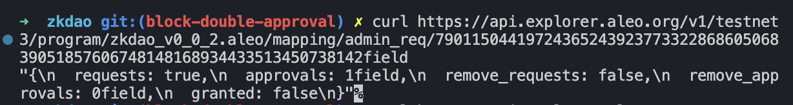
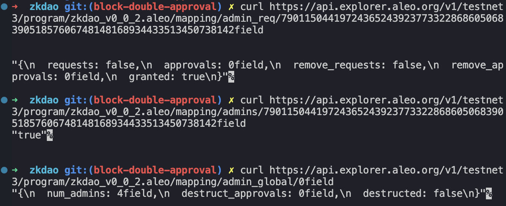
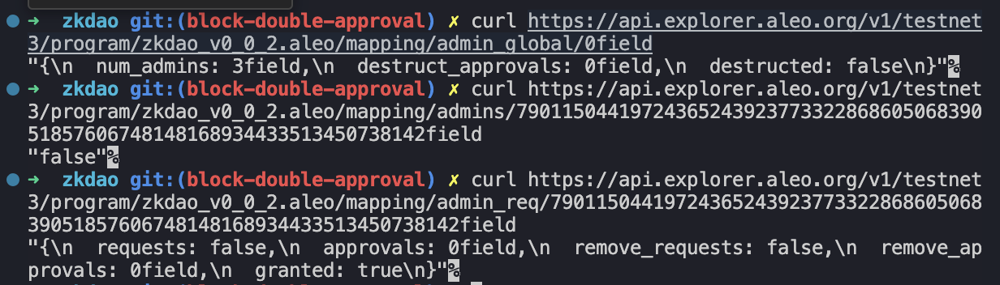
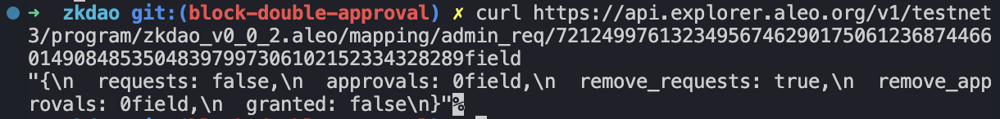
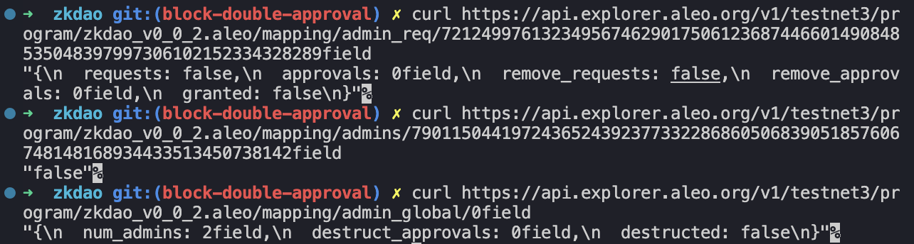
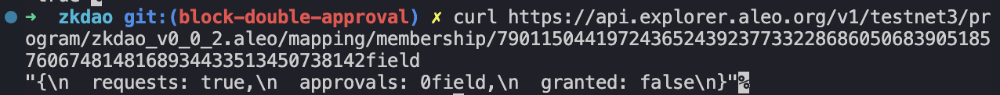
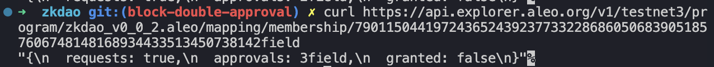
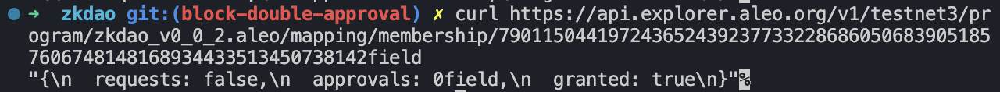
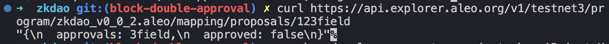
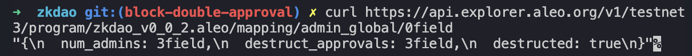

# Idea
The primary goal of ZK DAO is to provide users of the Aleo blockchain with a means of voting on proposals and/or participating in collective asset ownership with complete privacy, i.e. no need to expose account addresses, etc.

# Problem
Publicly accessible records of membership and voting history in a DAO, especially on transparent platforms like the Ethereum blockchain, can lead to potential privacy breaches and may expose members to undue influence, targeted lobbying, or even retaliatory actions based on their past decisions.

# Solution
ZK DAO aims to add a layer of privacy to the common UX features of a DAO, namely by providing private (but verifiable) membership, voting and asset ownership. As such, many of the above-listed concerns will be addressed by not being able to tie DAO activity with a public account address.

# Features
ZK DAO will be initiated with a starting set of admins (identified by their Aleo account addresses) who can in turn approve or reject members to the DAO. Membership will be provable but not publicly listed.
In its first iteration, the DAO will allow for submitting proposals, which will be publicly viewable. Proposals can be voted on by members of the DAO at any time prior to the proposal’s voting cutoff timestamp. Member votes will not be publicly listed, but a count of all yes and no votes for a particular proposal will be.

# Tests ran on testnet3

Deployed v0.0.2: https://explorer.aleo.org/program/zkdao_v0_0_2.aleo

## Initialised 3 admins
Granted 1st admin: https://explorer.aleo.org/transaction/at1tu3k07fmp2z9r084cjyqhmvgwnj5taq9sfhkxhtqf7trx6gtpczsvykhkp  
Granted 2nd admin: https://explorer.aleo.org/transaction/at19thga6gxqs8ltfgetp0zmf8uu24mu5v27hgerw6t8rka7v53jyps098w2g  
Granted 3rd admin: https://explorer.aleo.org/transaction/at1rnf4w4h9tu8qrferz8kqnm0h8wec32ahd9r9cf72hew9896skurqajpzcf  

## Request adding 4th admins decentralised way
Request 4th admin: https://explorer.aleo.org/transaction/at18kk45cd8dcl56q5yl67k0cm0788vfnzlq42d9233yqxrj0uwxs8q2ey0jh

Approve admin 1: https://explorer.aleo.org/transaction/at13v9nmhpmcark0d435gxa852q5gdsgwnynd37hzsa34yll6w56cqqqznum6

Check request == true and 1 approval:

Approve admin 2: https://explorer.aleo.org/transaction/at1a3raugcx02sr9amk9pv2s50hnl38gux7pw0uw40m3eerrshcpsrsqj8tnr  
Approve admin 3: https://explorer.aleo.org/transaction/at1sygpk6lelwdqn6c3nssf8a0eqeg0pv0pu9yqwp4n0udgmaj65srqzstr9n  

Check 4th admin granted status, admins boolean and global num_admins:

Remove 4th admin by owner: https://explorer.aleo.org/transaction/at1ytue5ujcc765v0agc7u3m94c70k8ffzn57fqsr840kg93a5j4cysqmxmrr

After 4th admin removal:

## Remove admin decentralised way
Request remove 3rd admin: https://explorer.aleo.org/transaction/at1ycqwl2h7njyk43x9qw0tk5g004xf342jhfgcu33f82sywx77vy8qmf0a00

Not authorised address calling approve: https://explorer.aleo.org/transaction/at1erz40rmru6drr0w7nqlvyddq5f90s8ag7k7n87hcg0x2auwpzcxqsm6ta3  
(Transaction broadcasted but never get included on chain)  
Calling approve without unblock: https://explorer.aleo.org/transaction/at1wsspl3v25esuypgfkj30ggpxmeysrzprdvylmszp7f772hhveg8qp9jlr9  
(Transaction broadcasted but never get included on chain)  

Unblock admin 1: https://explorer.aleo.org/transaction/at1le5y6nvysq7ev826pxk2kfyv0szp6dv7ysdctphqasltarezwyzs5pql7l  
Unblock admin 2: https://explorer.aleo.org/transaction/at1p92rhzr9a0m28j27he6flmanh823r68xd3fujsdrc3mdp3lfr5gqsz4dp9  
Unblock admin 3: https://explorer.aleo.org/transaction/at1ja7jm7dpmrc4zx9jkweyu393ns9mgwlpmaz63wa6stn0t4x3cgzq5g79lp  

Approve remove 1: https://explorer.aleo.org/transaction/at1g9m3ufneaqwz766g5wzc63juk3jsq47qlgpysfqu0kg5v56u75gqsn4e3f  
Approve remove 2: https://explorer.aleo.org/transaction/at1p0knvm6e0xq8405pq4vf3rjv78xyywm8raacqzkdajg2nmlreuyqu6pqkw  
Approve remove 3: https://explorer.aleo.org/transaction/at1sq3e3r99xh7c6v94nqf8dda0alp0muumv3scf9afcyj58h3f3g8s3cmyar  
Remove admin: https://explorer.aleo.org/transaction/at1jata8767a23fpcpmlptf09ern6xy0thcsy4q87ket04auzzx7vgsfyxjve  
Unblock all again

Admin access turns false, num_admins dropped to 2:

## Request to join as member
Request membership: https://explorer.aleo.org/transaction/at10hh44y8utn03q7dtjw9d8tt0pjfrgq5lnn8dwav7ckk75lcv7ygsavred6

Approve member 1: https://explorer.aleo.org/transaction/at1pku4s2h9qmjeyrdy84ve72de50zz3cs047q28c6775wqcz2cxs8scjp8hf  
Approve member 2: https://explorer.aleo.org/transaction/at10vf9402m7gkwv0u5u7mrgwkpvaqrwxpfk98n5pk80m29cayk8ypsps0elf  
Approve member 3: https://explorer.aleo.org/transaction/at159a97xruetu0dwq2924n93sjg59mkc5j8y23nsnh85xl95awacpqr7relt  

3 approvals for adding member:

Membership granted: https://explorer.aleo.org/transaction/at1u9kcees3pczmw8ts42v5vfcynym4es6xqlp6hwdvk9sapgytryrqnx7yth

## Making proposal by member and voting
Make proposal by member: https://explorer.aleo.org/transaction/at1ax3zqvnjup9ccj52d4zfu2kgrle87wn4z4ye7kn3jqh0ahmxjq8qfxm9zc
Unblock all again

Member vote 1: https://explorer.aleo.org/transaction/at1c4qlvs66w72kf9ltd3xzr3rwsrln6gehjm4gs47hp65xxx22jvzqjjg6ag  
Admin vote 2: https://explorer.aleo.org/transaction/at1sp5cuq690t5x40pxmfkc9ylnqyuw473nusleamt8vj5aasdk7yyq6mcw5s  
Admin vote 3: https://explorer.aleo.org/transaction/at1tl3a8mphgknnqz02avyk2lg7cvydqf40rn3dfdt97jt35ghxjy9qkhczdc  

Unblock all again

Pass proposal: https://explorer.aleo.org/transaction/at1kvp7ky0peen5e9fepmm3ha8g7meavez65hy58t20at5vundx3szs0v2whh

## Destructing owner access
Approve destruct 1: https://explorer.aleo.org/transaction/at1m5rtmqk68qh33lqmdz00fh020zufuq9kc8hqkf68xzrd9qz3f58su7tmcx  
Approve destruct 2: https://explorer.aleo.org/transaction/at1ueywtke2lj3gu3m7ahkgtd0qgphvtu00l6u8w4cap2fnhc7vxygqq8kkf2  
Approve destruct 3: https://explorer.aleo.org/transaction/at1ud3fyw5a892n6g0wymp5aqz7r83dtsz9lfzzdrzpthae5ft0hcgqapzaj7  
Unblock all again

Destruct owner: https://explorer.aleo.org/transaction/at16ftvarcrchxtazt0tpgnraav5s7a9scmkzt0hlkkqdpjumvsryqqm4mrmt  
Global state of destruction:

Owner try call grant_admin_initial: https://explorer.aleo.org/transaction/at1xgv0nq3lavwv5cjz0fueyeu50kwapsu7le76pmfsucj5mju2vgpsj0t6a5  
(Transaction broadcasted but never get included on chain)

## Bug fix
Deployed zkdao_v0_0_3: https://explorer.aleo.org/transaction/at1ec0mpd0ehrt3tf86y6k0ae3x7zhdfntettlnw3f8ca9dmk667gps47zq0k  
(minor bug fix)
